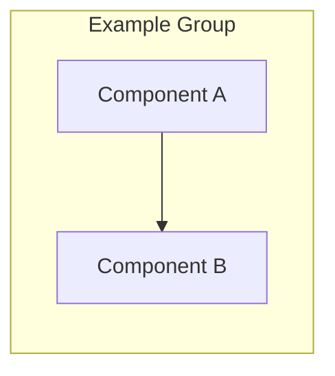

---
tags:
  - template
  - diagram
  - documentation
---
# [Diagram Name]

## Overview

[Describe the system, topology, or relationship shown in this diagram.]

## Components

| Component | Role | Notes |
| --- | --- | --- |
| [component] | [role] | [notes] |

## Traffic or Dependency Flow

1. [flow step]
2. [flow step]
3. [flow step]

## Operational Notes

- [note]
- [note]

## Related Pages

  <a class="card" href="../[related-path]/">
    <strong>[Related Page]</strong>
    [Short description]
  </a>

